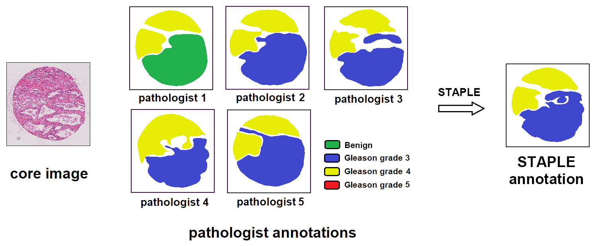
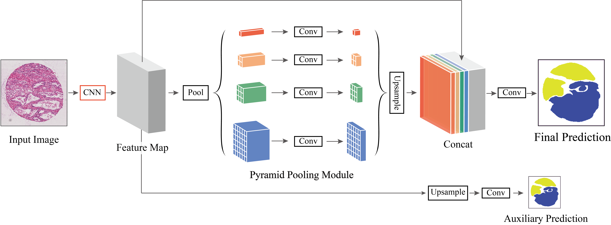

# PSPNet for MICCAI Automatic Prostate Gleason Grading Challenge 2019
This is the code for MICCAI Automatic Prostate Gleason Grading Challenge 2019. Check [here](https://gleason2019.grand-challenge.org/Home/) and [here](https://bmiai.ubc.ca/research/miccai-automatic-prostate-gleason-grading-challenge-2019), we took the 1st place of task 1: pixel-level Gleason grade prediction and task 2: core-level Gleason score prediction ([leaderboard](https://gleason2019.grand-challenge.org/Results/)).

Task 1 is regarded as a segmentation task, and we use PSPNet for this. And for task 2, we do not train a different network, but just produce the prediction from the prediction of task 1 according to the Gleason grading system.

The train script is based on reference script from torchvision 0.4.0 with minor modification. So, you need to install the latest PyTorch and torchvision >= 0.4.0. Check [requirements.txt](requirements.txt) for all packages you need.

This repo use [GluonCV-Torch](https://github.com/zhanghang1989/gluoncv-torch), thanks for Hang Zhang's outstanding work!

## Preprocessing
Each image is annotated in detail by several expert pathologists. So how to use this annotations is important. We use STAPLE to create final annotations used in training. Check the [preprocessing.py](preprocessing.py) script for detail.

## Training

To run the training, simply run `python train.py`, check `python train_gleason.py --help` for available args.

## Inference
To run the inference, simply run `python inference.py`, check `python inference.py --help` for available args.

## Note
I don't quite understand task2, and got it wrong when I participated this challenge. I would sincerely advise you read [this paper](https://ieeexplore.ieee.org/abstract/document/8853320/), which is written by the organizers and submitted to JBHI, for more detail about this challenge. I would not update any codes in this repository anymore. 
